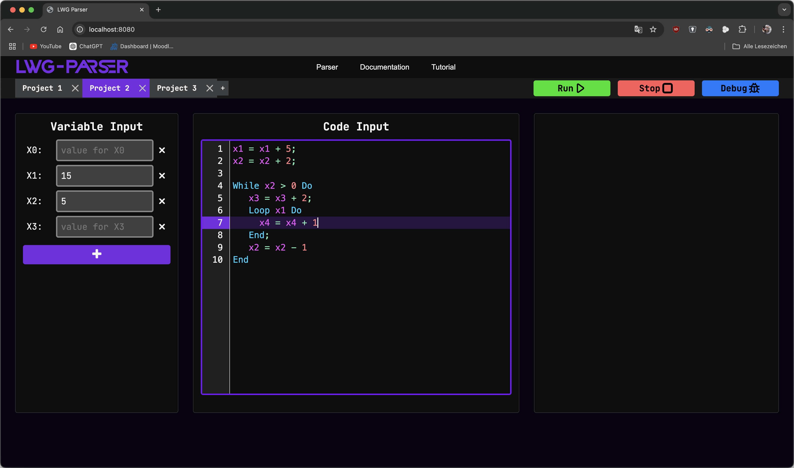

<h1 align="center">
  <a href="https://github.zhaw.ch/LWG/lwg-parser">
    <picture>
      <source height="125" media="(prefers-color-scheme: dark)" srcset="docs/LWG-Logo.svg">
      
    </picture>
  </a>
</h1>
<p align="center">
<b>LWG</b> is an open-source, fast and easy to use LOOP, WHILE and GOTO interpreter written in Java.
</p>



---
## ⚙️ Installation

To install and self-host the **LWG** interpreter, you can clone the repository using one of the following commands:
```bash
// SSH
git clone git@github.zhaw.ch:LWG/lwg-parser.git

// HTTPS
git clone https://github.zhaw.ch/LWG/lwg-parser.git
```

After that you navigate in the frontend_build directory with the following command:
```bash
cd lwg-parser/lwg-parser-app/src/frontend_build/
```

Now we need to first install all the dependencies needed for our project. <br />
We only need to do this once.
To do this, we use the following command:
```bash
npm install
```

All dependencies are now installed. < \br>
Now we build our final file which is then used by our program. <br />
```bash
npm run build
```

Finally, we are all set up and can start our program. <br />
To do this, we navigate back to the root directory of our project and use the following command:
```bash
./gradlew bootRun
```

## ⚡️ Quickstart

After the installation, you can access the **LWG** interpreter by visiting the following URL in your browser https://localhost:8080.

## 🎯 Features

- **LOOP** interpreter
- **WHILE** interpreter
- **GOTO** interpreter
- **Debugging** tools
- **Syntax highlighting**
- **Precise** and **detailed** error messages
- **Documentation** and **Tutorials**

## 💡 Future Roadmap

- [ ] Integrate **LWG** into existing **IDEs**
- [ ] **Code completion** and **suggestions**
- [ ] **Command line** interface
- [ ] **Import** and **export** of **scripts**

## 🕶️ Contributors

Alphabetically sorted list of contributors who developed and maintain this amazing project.

- [Moritz Feuchter](https://github.zhaw.ch/feuchmor)
- [Din Jakupi](https://github.zhaw.ch/jakupdin)
- [Nicola Meier](https://github.zhaw.ch/meiern03)
- [Dominic Odermatt](https://github.zhaw.ch/odermdo1)
- [Tobias Zülli](https://github.zhaw.ch/zuelltob)

## 💻 Sponsors

